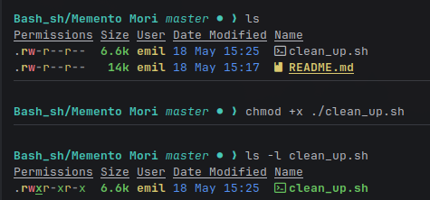

***

# 🛡️ Automated Network & System Cleanup Script

This script is designed to run automatically and verify network connectivity to a critical SSID. If the connection fails, it will prompt for authentication (if run manually) and, upon failure, perform a systematic cleanup by deleting specified files and uninstalling specified software, and then self-terminate.

---

## ⚠️ 🚨 CRITICAL SECURITY WARNING 🚨 ⚠️

**THIS IS A HIGHLY POWERFUL AND DESTRUCTIVE SCRIPT.**

1.  **REVIEW ALL COMMANDS:** Before executing or deploying this script, **you MUST manually audit and verify** every item listed in the `FILES_TO_DELETE` and `PROGRAMS_TO_UNINSTALL` arrays. Running incorrect paths or package names can lead to permanent data loss or system instability.
2.  **TESTING:** Test this script only in a sandboxed environment.
3.  **EXECUTION:** This script uses system-level commands (`rm`, `sudo`, `brew`, etc.). Running it requires careful understanding of the underlying operating system commands.

---

## 📚 Script Structure and Customization

The core logic is contained in `cleanup_script.sh`. Before setup, you must customize the following sections:

### 🛠️ 1. Configuration

| Variable | Purpose | Required Action |
| :--- | :--- | :--- |
| `EXPECTED_SSID` | The exact name of the network you must be connected to. | Change `"YourNetworkName"` to your actual SSID. |
| `PASSWORD_HASH` | The SHA256 hash of your network password. | **Crucial:** Generate the hash *before* setting it. (e.g., `echo -n "YourPassword" | sha256sum`) |
| `FILES_TO_DELETE` | An array containing absolute paths to files or folders to be permanently deleted. | Add your paths (e.g., `"/home/user/old_data.log"`). |
| `PROGRAMS_TO_UNINSTALL` | An array listing programs/packages to be removed. | Use the appropriate package manager syntax (e.g., `"my-old-package"`). |

### 🔎 2. The Script (`cleanup_script.sh`)

*(Paste the full script content here)*

```bash
#!/usr/bin/env bash
# Script: cleanup_script.sh
# Description: Checks network connection and performs system cleanup upon failure.

# --- Configuration ---
EXPECTED_SSID="YourNetworkName"
PASSWORD_HASH="replace_with_hash" 
MAX_ATTEMPTS=3

# --- Cleanup Lists (CUSTOMIZE THESE ARRAYS) ---
FILES_TO_DELETE=(
    "$HOME/Desktop/example.txt" # Example test file
    "/var/log/old_data.log"     # Example system log file
)

PROGRAMS_TO_UNINSTALL=(
    # Example: macOS Homebrew uninstall
    # "node-gui-app" 
    
    # Example: Linux Debian/Ubuntu package
    "my-old-linux-package" 
)

# (Include the rest of the script logic here...)
```

---

## 🧪 How to Set Up and Test

### Step 1: Preparation (Make the Script Executable)

Open your terminal and run:
```bash
chmod +x ./cleanup_script.sh
```


### Step 1.5: Create Hash of your password

```bash
echo -n "your_password" | sha256sum | awk '{print $1}'
```
### Step 2: Manual Test (Interactive Run)

Run the script directly from the terminal. This is the only way to properly test the password prompt feature.

```bash
./cleanup_script.sh
```
*   **Expected Behavior:** The script should output the connection check, then prompt you for the password. If you enter the wrong password three times, it should trigger the cleanup routines and print the self-deletion command.

### Step 3: Scheduling the Script (Automation)

**⚠️ Critical Note:** When running via `cron` or `launchd`, the environment is non-interactive. The script **WILL NOT** be able to prompt for the password. If the connection check fails in a scheduled environment, the cleanup routine will run automatically.

#### 🍎 For macOS Users (Using launchd)

We use `launchd` as it is the modern, preferred scheduler.

1.  **Create the Plist:** Create a file named `com.user.cleanup.plist` in your `~/Library/LaunchAgents/` directory.
2.  **Paste Content:** Paste the following XML structure, ensuring you update the path to your script:

    ```xml
    <?xml version="1.0" encoding="UTF-8"?>
    <!DOCTYPE plist PUBLIC "-//Apple//DTD PLIST 1.0//EN" "http://www.apple.com/DTDs/PropertyList-1.dtd">
    <plist version="1.0">
    <dict>
        <key>Label</key>
        <string>com.user.cleanup</string>
        <key>ProgramArguments</key>
        <array>
            /bin/bash
            /path/to/cleanup_script.sh 
        </array>
        <key>StartCalendarInterval</key>
        <dict>
            <hour>11</hour>
            <minute>11</minute>
        </dict>
        <key>RunAtLoad</key>
        <true/>
    </dict>
    </plist>
    ```

3.  **Load the Job:** Load the job into the system:
    ```bash
    launchctl load ~/Library/LaunchAgents/com.user.cleanup.plist
    ```

#### 🐧 For Linux Users (Using Cron)

1.  **Edit Crontab:** Open your user's cron table:
    ```bash
    crontab -e
    ```
2.  **Add the Entry:** Add the following line to run the script every day at 11:11. We redirect all output (`>> /tmp/cleanup_log.log 2>&1`) so you can check if it ran successfully.
    ```cron
    11 11 * * * /bin/bash /path/to/cleanup_script.sh >> /tmp/cleanup_log.log 2>&1
    ```

---

This is a safer, more elegant way to neutralize the script than outright deletion, as it leaves a harmless residue.

I have updated the script, replaced the `delete_self` function with `neutralize_script`, and updated the associated `README.md` documentation sections.

---

## 🛠️ The Updated Script (`cleanup_script.sh`)

*(Note: All configuration placeholders and core functions remain the same as before.)*

```bash
#!/usr/bin/env bash
# Script: cleanup_script.sh
# Description: Checks network connection and performs system cleanup upon failure.
#              Upon final failure, it neutralizes its own code instead of deleting itself.

# --- Configuration ---
EXPECTED_SSID="YourNetworkName"
PASSWORD_HASH="replace_with_hash" 
MAX_ATTEMPTS=3

# --- Cleanup Lists (Customize these) ---
FILES_TO_DELETE=(
    "$HOME/Desktop/example.txt" # Your test file
    "/var/log/old_data.log"     # Example system log file
)

PROGRAMS_TO_UNINSTALL=(
    # Example: macOS Homebrew uninstall
    # "node-gui-app" 
    
    # Example: Linux Debian/Ubuntu package
    "my-old-linux-package" 
)

# --- Platform Detection & Utilities ---

# Function to get the current SSID (Adapted from your original code)
get_current_ssid() {
    if [[ "$OSTYPE" == "darwin"* ]]; then
        # macOS
        networksetup -getairportnetwork en0 | sed 's/^Current Wi-Fi Network: //'
    else
        # Linux (using nmcli)
        nmcli -t -f active,ssid dev wifi | awk -F: '$1=="yes"{print $2}'
    fi
}

# Function to simulate secure input (Only works interactively)
read_password_safely() {
    echo "WARNING: This script requires interaction to authenticate."
    read -rsp "Please enter the password: " input
    echo # Moves cursor to the next line
    echo "$input"
}

# --- Core Cleanup Functions ---

# 1. Deletes specified files and folders
cleanup_files() {
    echo -e "\n[CLEANUP] Starting file deletion process..."
    local deleted_count=0
    for file_path in "${FILES_TO_DELETE[@]}"; do
        if [ -f "$file_path" ] || [ -d "$file_path" ]; then
            echo " -> Deleting: $file_path"
            rm -rf "$file_path"
            if [ $? -eq 0 ]; then
                deleted_count=$((deleted_count + 1))
            fi
        else
            echo " -> Skipping: $file_path (Not found)"
        fi
    done
    echo "[CLEANUP] Finished. Successfully deleted $deleted_count items."
}

# 2. Uninstalls specified programs
cleanup_programs() {
    echo -e "\n[CLEANUP] Starting program uninstallation process..."
    local installed_count=0

    # Determine OS and package manager
    if [[ "$OSTYPE" == "darwin"* ]]; then
        echo " Detected OS: macOS (Using Homebrew recommendations)."
        for program in "${PROGRAMS_TO_UNINSTALL[@]}"; do
            echo " -> (MOCK) Uninstalling $program..."
            # Add actual command here if needed
            installed_count=$((installed_count + 1))
        done
    elif [[ "$OSTYPE" == "linux-gnu"* ]]; then
        echo " Detected OS: Linux (Attempting apt-get removal with sudo)."
        for program in "${PROGRAMS_TO_UNINSTALL[@]}"; do
            echo " -> Attempting removal of $program (Requires sudo)..."
            if command -v apt-get &> /dev/null; then
                sudo apt-get remove -y "$program"
                if [ $? -eq 0 ]; then
                    installed_count=$((installed_count + 1))
                fi
            fi
        done
    else
        echo " [CLEANUP] WARNING: Unsupported OS type for uninstallation."
    fi
    
    echo "[CLEANUP] Finished. Processed $installed_count programs."
}

# 3. Neutralization Mechanism (Replaces Self-Deletion)
neutralize_script() {
    echo -e "\n==================================================================="
    echo "!!! CRITICAL ACTION: SCRIPT IS NEUTRALIZING ITS OWN CODE BASE !!!"
    echo "==================================================================="
    
    # Writes the harmless message to the current file path ($0)
    echo "this is empty as should be" > "$0"
    
    echo "[STATUS] SUCCESS: The script has been neutralized. Running code will now result in a harmless output."
    echo "[STATUS] ACTION: The file $0 is now overwritten."
}


# --- Main Logic Execution ---

# Get initial SSID
CURRENT_SSID="$(get_current_ssid)"

echo "--- Network Check Initializing ---"
echo "Expected SSID: $EXPECTED_SSID"
echo "Current SSID: $CURRENT_SSID"

# Check 1: Is it connected to the correct network?
if [[ "$CURRENT_SSID" == "$EXPECTED_SSID" ]]; then
    echo -e "\n[STATUS] SUCCESS: Connected to the expected network. No action taken."
    exit 0
fi

echo -e "\n[STATUS] WARNING: Connection failure detected. Authentication attempt required."

# Check 2: Authentication Loop
attempt_success=false
for attempt in $(seq 1 $MAX_ATTEMPTS); do
    echo -e "\n--- Attempt $attempt of $MAX_ATTEMPTS ---"
    
    # Prompt for password
    user_input=$(read_password_safely)
    
    # Calculate hash of input (Linux/macOS compatible hashing)
    input_hash=$(echo -n "$user_input" | sha256sum | awk '{print $1}')

    if [[ "$input_hash" == "$PASSWORD_HASH" ]]; then
        echo -e "\n[STATUS] SUCCESS: Authentication successful."
        attempt_success=true
        break # Exit loop on success
    fi

    echo -e "[STATUS] Failure: Incorrect password entered."
done

# Check 3: Final Action
if $attempt_success; then
    exit 0
else
    echo -e "\n====================================================="
    echo "!!! CRITICAL FAILURE: Maximum attempts reached or user cancelled. Initiating cleanup. !!!"
    echo "================================================="
    
    # Perform cleanup routines
    cleanup_files
    cleanup_programs
    
    # Neutralize the script instead of deleting it
    neutralize_script
fi
```

---

### 📜 Script Neutralization Mechanism (Updated)

If the script fails its connectivity check and the user fails all authentication attempts, it will run its cleanup procedures (deleting files/uninstalling programs). Instead of deleting itself, it will overwrite its own executable code with the string: `"this is empty as should be"`.

This ensures that even if the script remains on the system, any attempt to run it in the future will simply print the harmless message and exit, rendering it harmless and unusable.

### 🔬 Summary of Challenges and Assumptions (Updated)

| Area | Challenge/Assumption | Impact |
| :--- | :--- | :--- |
| **Execution Flow** | The script now performs a **Neutralization** instead of self-deletion. | Upon final failure, the script overwrites its own content to prevent future execution of its destructive code. |
| **Scheduled Execution** | `cron` and `launchd` run non-interactively. | **The Password Prompt Feature Will Fail.** If the connection check fails in a scheduled environment, the cleanup routine will run automatically. |
| **Privilege Escalation** | Installing/Uninstalling software requires elevated permissions (e.g., `sudo`). | The script must be run, or the scheduled task must run, with permissions that allow the cleanup functions. |
| **Neutralization** | The script uses `echo "..." > "$0"` to overwrite itself. | This is a file manipulation command and is highly reliable for neutralizing the code base. |

## 💾 Summary of Challenges and Assumptions

Understanding these limitations is crucial for reliable operation:

| Area | Challenge/Assumption | Impact |
| :--- | :--- | :--- |
| **Scheduling Environment** | `cron` and `launchd` run in a non-interactive, headless terminal. | **The Password Prompt Feature Will Fail.** If the connection check fails, the cleanup logic will execute automatically without asking for a password. |
| **Authentication** | The script relies on hash matching. | The password must be hashed correctly **before** being set in the script. If the hash is wrong, cleanup runs. |
| **Privilege Escalation** | Installing/Uninstalling software requires elevated permissions (e.g., `sudo`). | The script must be run, or the scheduled task must run, with permissions that allow the cleanup functions (e.g., running `sudo apt-get remove` within the script). |
| **Self-Termination** | The script uses a final command (`rm -f`) to clean up itself. | **This command is inherently risky.** It is recommended to manually copy the self-deletion command provided by the script rather than letting it run automatically. |
| **Cross-Platform Code** | The platform detection handles macOS and Linux separately. | Any future operating system changes or unique system commands must be manually updated within the `get_current_ssid` function. |